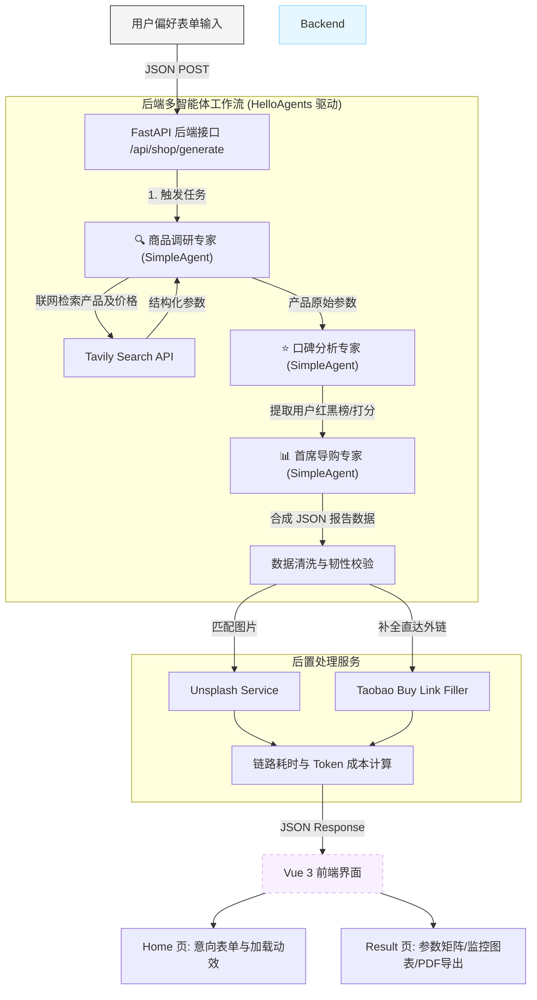

# 🛒 HelloAgents 智能电商导购助手

基于 **HelloAgents 框架 + FastAPI + Vue 3 (Vite + TypeScript + Ant Design Vue)** 搭建的高性能、低延时的智能电商导购助手系统。该系统集成了实时联网检索、多智能体协同分析、用户口碑情绪提取以及大模型链路成本监控等核心功能。

---

## 🌟 核心特性

- **多智能体协同流水线 (Multi-Agent Pipeline)**：系统解耦为 **商品调研专家**（具备 Tavily 实时联网搜索能力）、**口碑分析专家**（提炼红黑榜优缺点）与 **首席导购专家**（负责决策合成与结构化 JSON 整合），各司其职，准确率高。
- **媒体与链路自完备**：智能对接 Unsplash API 补全商品缩略图，并根据推荐结果自动进行“引导式转化”——补全淘宝直达搜索外链。
- **全链路实时监控 (Full-Link Monitoring)**：统计并回传单次多 Agent 执行耗时、Token 消耗折合人民币（CNY）成本、系统并发压力等运维指标，并在前端仪表盘进行渲染。
- **可视化参数对比**：前端动态渲染各型号商品的核心规格对比矩阵、价格走势分析图表，并支持一键将导购报告导出为 PNG 图片或 PDF 报告。
- **高韧性降级保护 (Resilience Fallback)**：对 AI 产生的 JSON 输出进行清洗（扁平化嵌套结构，补充默认值），若发生异常则无缝触发系统服务降级，展示预设精选方案。

---

## 📐 系统架构与数据流

系统的核心交互逻辑如下所示：



---

## 📂 项目目录结构

```text
E:\AI\LLM\shopping guide agent/
├── test.py                           # 本地免启动调试 Agent 的测试脚本
├── development_rules.md              # 团队协作：代码修改请示规范
├── README.md                         # 本项目说明文档
├── .gitignore                        # Git 忽略配置
├── backend/                          # 后端服务
│   ├── run.py                        # Uvicorn 启动文件
│   ├── logger.py                     # 全局日志系统 (Stream + File)
│   └── app/
│       ├── config.py                 # 应用环境变量配置与校验
│       ├── agents/
│       │   └── shopping_guide_agent.py  # 核心 Agent 定义 (调研、口碑、导购)
│       ├── api/
│       │   ├── main.py               # FastAPI 主程序入口与全局 CORS
│       │   └── routes/
│       │       └── shop.py           # 电商路由、并发监控与后置处理
│       ├── models/
│       │   └── schemas.py            # Pydantic 传输模型与预算校验器
│       └── services/
│           ├── llm_service.py        # LLM 客户端单例与重试机制 (tenacity)
│           └── unsplash_service.py   # Unsplash 图片检索 API 服务
└── frontend/                         # 前端服务
    ├── package.json
    ├── vite.config.ts
    ├── tsconfig.json
    └── src/
        ├── App.vue                   # 页面入口组件
        ├── main.ts                   # 路由挂载与 Ant Design 初始化
        ├── services/
        │   └── api.ts                # Axios 网络请求封装 (超长 Timeout 优化)
        ├── types/
        │   └── index.ts              # 严格对齐 Pydantic 的 TypeScript 声明
        └── views/
            ├── Home.vue              # 精美意向表单输入、阶段加载动画
            └── Result.vue            # 对比矩阵、指标渲染、导出 PNG/PDF 功能
```

---

## 🚀 本地快速启动指南

### 1. 后端服务启动

1. 进入后端目录，安装相关依赖：
   ```bash
   cd backend
   pip install -r requirements.txt
   ```
2. 配置环境变量：
   在 `backend/` 目录下创建 `.env` 文件，并填写必要的 API 密钥：
   ```env
   OPENAI_API_KEY=your-openai-api-key
   OPENAI_BASE_URL=https://api.openai.com/v1
   OPENAI_MODEL=gpt-4

   TAVILY_API_KEY=your-tavily-api-key
   UNSPLASH_ACCESS_KEY=your-unsplash-access-key
   ```
3. 运行服务：
   ```bash
   python run.py
   ```
   后端将在 `http://localhost:8000` 启动，您可以通过访问 `/docs` 查看 Swagger API 文档。

### 2. 前端服务启动

1. 进入前端目录，安装依赖：
   ```bash
   cd ../frontend
   npm install
   ```
2. 启动开发服务器：
   ```bash
   npm run dev
   ```
   前端服务默认在 `http://localhost:5173` 启动，打开浏览器即可开始使用。
