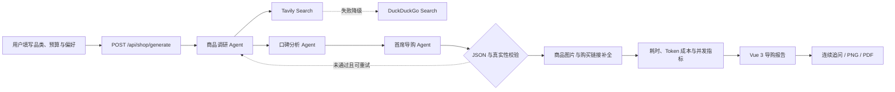

<div align="center">

# 🛒 Shopping Guide Agent

**基于 LangGraph、FastAPI 与 Vue 3 的全栈 AI 智能电商导购助手，支持实时商品检索、多智能体分析、连续追问与导购报告导出。**

[English](README_EN.md) · [中文](README.md)


</div>

---

一个基于 **LangGraph、LangChain、FastAPI 与 Vue 3** 构建的全栈 AI 导购项目。系统会根据商品类别、预算、品牌倾向和自然语言需求检索在售商品，由多个职责明确的智能体依次完成商品调研、口碑分析与购买决策，并生成可交互、可导出的结构化导购报告。

> 项目当前面向中文购物场景，默认以人民币展示价格，并自动生成淘宝搜索入口。商品信息来自实时搜索与大模型整理，购买前仍建议前往官方渠道核验价格、库存和规格。

## 核心能力

- **LangGraph 多智能体工作流**：商品调研、口碑情绪分析和首席导购三个节点顺序协作，最终输出经过 Pydantic 校验的结构化报告。
- **实时商品检索**：优先使用 Tavily 搜索商品型号、价格、规格和来源；服务异常时自动降级到 DuckDuckGo。
- **图片三级降级链路**：依次尝试 Tavily 商品图片、DuckDuckGo 图片搜索和 Unsplash，尽量为每个推荐结果补充产品图。
- **反射校验与自动重试**：拦截空推荐列表及明显的占位品牌或虚构型号，最多进行两轮带错误反馈的重新调研。
- **短期会话记忆**：通过 LangGraph `MemorySaver` 和 `session_id` 保存同一会话的状态，支持基于上一份报告继续追问和调整偏好。
- **全链路指标**：接口返回总响应耗时、按配置折算的 LLM 调用成本、累计请求数与当前并发数。
- **交互式对比报告**：展示推荐商品、动态参数矩阵、价格统计、综合首选、性价比首选和专家避雷建议。
- **报告导出**：前端可将完整报告导出为 PNG 或 PDF，并自动补全商品购买搜索链接。
- **故障兜底**：模型调用、JSON 解析或工作流执行失败时返回预设降级报告，避免接口直接中断。

## 工作流程


```mermaid
flowchart LR
    U[用户填写品类、预算与偏好] --> API[POST /api/shop/generate]
    API --> R[商品调研 Agent]
    R --> TS[Tavily Search]
    TS -. 失败降级 .-> DDG[DuckDuckGo Search]
    R --> S[口碑分析 Agent]
    S --> A[首席导购 Agent]
    A --> V{JSON 与真实性校验}
    V -. 未通过且可重试 .-> R
    V --> I[商品图片与购买链接补全]
    I --> M[耗时、Token 成本与并发指标]
    M --> UI[Vue 3 导购报告]
    UI --> F[连续追问 / PNG / PDF]
```

### 后端状态图

1. `research`：组合用户需求并联网搜索真实商品，交由 LLM 提炼候选型号、规格和价格。
2. `sentiment`：从调研结果中总结好评点、常见短板、不适合人群和专家评分。
3. `advisor`：合并调研与口碑信息，输出符合 `ShoppingReport` 模型的 JSON。
4. `image_link`：搜索商品图片，并在缺少购买地址时生成淘宝搜索链接。
5. `route_after_validation`：检查推荐列表和可疑占位商品；失败时携带反馈重新执行，成功后结束。

## 技术栈

| 层级 | 技术 |
| --- | --- |
| 智能体编排 | LangGraph、LangChain |
| 大模型接入 | `langchain-openai`，兼容 OpenAI 风格 API |
| 实时搜索 | Tavily、DuckDuckGo |
| 图片服务 | Tavily、DuckDuckGo、Unsplash |
| 后端 | Python、FastAPI、Pydantic、Uvicorn |
| 前端 | Vue 3、TypeScript、Vite、Ant Design Vue |
| HTTP | Axios、Requests |
| 报告导出 | html2canvas、jsPDF |

## 项目结构

```text
shopping-guide-agent/
├── backend/
│   ├── app/
│   │   ├── agents/
│   │   │   └── shopping_guide_agent.py  # LangGraph 工作流与导购逻辑
│   │   ├── api/
│   │   │   ├── main.py                  # FastAPI 应用入口
│   │   │   └── routes/shop.py           # 报告生成接口与链路指标
│   │   ├── models/schemas.py            # 请求、商品和报告数据模型
│   │   ├── services/
│   │   │   ├── llm_service.py           # LLM 单例及重试配置
│   │   │   └── unsplash_service.py      # Unsplash 图片服务
│   │   └── config.py                     # 环境变量与应用配置
│   ├── logger.py                         # 控制台与文件日志
│   ├── requirements.txt                  # Python 依赖
│   └── run.py                            # 后端启动脚本
├── frontend/
│   ├── src/
│   │   ├── services/api.ts               # Axios API 客户端
│   │   ├── types/index.ts                # TypeScript 数据类型
│   │   ├── views/Home.vue                # 需求表单
│   │   ├── views/Result.vue              # 报告、追问与导出页面
│   │   ├── App.vue                       # 根组件
│   │   └── main.ts                       # 路由与应用初始化
│   ├── package.json
│   ├── tsconfig.json
│   └── vite.config.ts
├── test.py                               # Agent 调用示例
├── test_tavily.py                        # Tavily 连通性测试
├── README.md                             # 中文文档
└── README_EN.md                          # English documentation
```

## 快速开始

### 1. 环境要求

- Python 3.10+
- Node.js 18+
- npm
- 一个兼容 OpenAI Chat Completions 接口的模型服务
- Tavily API Key（推荐；缺失或调用失败时会尝试 DuckDuckGo）
- Unsplash Access Key（可选，仅用于最终图片兜底）

### 2. 配置并启动后端

```bash
cd backend
python -m venv .venv
```

激活虚拟环境后安装依赖：

```bash
pip install -r requirements.txt
```

在 `backend/.env` 中配置：

```env
# 可使用 LLM_* 或对应的 OPENAI_* 变量
LLM_API_KEY=your-api-key
LLM_BASE_URL=https://api.openai.com/v1
LLM_MODEL_ID=your-model-id

TAVILY_API_KEY=your-tavily-api-key
UNSPLASH_ACCESS_KEY=your-unsplash-access-key

# 可选：按人民币/千 Token 配置成本估算
LLM_INPUT_PRICE_PER_K=0.01
LLM_OUTPUT_PRICE_PER_K=0.02
```

启动服务：

```bash
python run.py
```

默认地址：

- API：`http://localhost:8000`
- Swagger UI：`http://localhost:8000/docs`
- ReDoc：`http://localhost:8000/redoc`
- 健康检查：`http://localhost:8000/health`

### 3. 启动前端

```bash
cd frontend
npm install
npm run dev
```

前端默认运行在 `http://localhost:5173`。开发服务器会将 `/api` 请求代理到 `http://localhost:8000`；也可以在 `frontend/.env` 中显式指定后端地址：

```env
VITE_API_BASE_URL=http://localhost:8000
```

## API 示例

### 生成导购报告

`POST /api/shop/generate`

```json
{
  "product_category": "主动降噪耳机",
  "budget_range": {
    "min": 1000,
    "max": 3000
  },
  "usage_scenarios": ["办公室", "长途飞行"],
  "brand_preference": ["索尼", "Bose"],
  "core_features": ["降噪强", "佩戴舒适"],
  "free_text_input": "优先考虑长时间佩戴舒适度",
  "session_id": "optional-conversation-id"
}
```

成功响应的 `data` 中包含：

- `recommended_products`：商品信息、规格、价格、口碑、评分和购买链接
- `decision_matrix`：按核心维度生成的横向对比矩阵
- `best_overall` / `best_budget`：综合首选与性价比首选
- `expert_tips` / `overall_summary`：避雷建议与总体结论
- `session_id`：连续追问使用的会话标识
- `metrics`：响应耗时、成本、累计请求量和并发指标

## 连续追问

报告页会复用后端返回的 `session_id`。用户输入新的限制（例如“预算降到 3000 元以内”或“哪款拍照最好”）后，前端再次调用生成接口，并用新结果替换当前报告。

`MemorySaver` 仅提供进程内短期状态：后端重启后会话不会保留，也不适合作为生产环境的持久化存储。

## 配置说明

| 变量 | 是否必需 | 说明 |
| --- | --- | --- |
| `LLM_API_KEY` / `OPENAI_API_KEY` | 是 | 模型服务密钥 |
| `LLM_BASE_URL` / `OPENAI_BASE_URL` | 否 | OpenAI 兼容 API 地址 |
| `LLM_MODEL_ID` / `OPENAI_MODEL` | 否 | 模型名称或 ID |
| `TAVILY_API_KEY` | 推荐 | 商品网页及图片搜索 |
| `UNSPLASH_ACCESS_KEY` | 否 | Unsplash 图片兜底 |
| `LLM_INPUT_PRICE_PER_K` | 否 | 每千输入 Token 成本，默认 `0.01` 元 |
| `LLM_OUTPUT_PRICE_PER_K` | 否 | 每千输出 Token 成本，默认 `0.02` 元 |
| `VITE_API_BASE_URL` | 否 | 浏览器请求的后端根地址 |

## 当前边界

- 搜索结果、价格、历史低价、评分和推荐结论由第三方搜索结果与模型综合生成，不构成价格承诺或购买建议。
- 购买链接当前为淘宝关键词搜索页，不代表项目与平台或商家存在合作关系。
- 服务指标保存在单个后端进程内，多进程或重启后不会延续。
- 默认 CORS 配置允许所有来源，生产部署前应收紧允许的域名范围。
- 内置兜底报告是固定示例，只用于保障接口可用性，不应视为实时推荐。

## 开发验证

前端类型检查与生产构建：

```bash
cd frontend
npm run build
```

后端语法检查：

```bash
python -m compileall backend
```

Tavily 连通性测试会产生真实 API 请求，请先配置密钥后再运行：

```bash
python test_tavily.py
```

## 安全提示

- 不要提交 `.env`、API Key、访问令牌或日志文件；项目的 `.gitignore` 已覆盖常见敏感文件。
- 生产环境应增加鉴权、请求限流、持久化监控和可信来源校验。
- 第三方图片可能存在防盗链或版权限制，正式产品应使用具备明确授权的媒体资源。

## License

仓库当前未声明开源许可证。在添加 LICENSE 文件前，代码默认保留全部权利。
