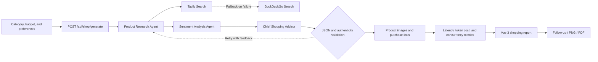

<div align="center">

# 🛒 Shopping Guide Agent

**A full-stack AI shopping assistant built with LangGraph, FastAPI, and Vue 3, featuring real-time product research, multi-agent analysis, follow-up conversations, and exportable buying reports.**

[English](README_EN.md) · [中文](README.md)


</div>

---

Shopping Guide Agent is a full-stack AI shopping application built with **LangGraph, LangChain, FastAPI, and Vue 3**. It searches for products based on a category, budget, brand preferences, and natural-language requirements. A set of specialized agents then performs product research, review analysis, and purchase decision synthesis to produce an interactive, exportable shopping report.

> The project currently targets Chinese-language shopping scenarios, displays prices in CNY, and generates Taobao search links. Product information is collected from live search results and organized by an LLM. Always verify prices, availability, and specifications through official sources before purchasing.

## Features

- **LangGraph multi-agent workflow**: product research, review sentiment analysis, and chief shopping advisor nodes work sequentially to produce a structured report validated with Pydantic.
- **Real-time product research**: Tavily is the primary source for current models, prices, specifications, and source pages, with an automatic fallback to DuckDuckGo.
- **Three-level image fallback**: product images are resolved through Tavily, DuckDuckGo image search, and finally Unsplash.
- **Reflection and automatic retries**: the workflow rejects empty recommendation lists and obvious placeholder brands or fabricated models, then retries with validation feedback up to two times.
- **Short-term conversation memory**: LangGraph `MemorySaver` and `session_id` preserve in-process conversation state for follow-up questions and preference adjustments.
- **Full-link metrics**: API responses include total latency, estimated LLM cost based on configurable token pricing, cumulative request count, and current concurrency.
- **Interactive comparison report**: the frontend presents recommended products, a dynamic specification matrix, price statistics, best-overall and best-value picks, and expert warnings.
- **Report export**: complete reports can be exported as PNG or PDF, while missing purchase URLs are populated with product search links.
- **Resilient fallback**: if model invocation, JSON parsing, or workflow execution fails, the API returns a predefined fallback report instead of terminating the request.

## Workflow



### Backend State Graph

1. `research`: builds a search query from the request, retrieves live product data, and asks the LLM to extract candidate models, specifications, and prices.
2. `sentiment`: summarizes positive feedback, common drawbacks, unsuitable user profiles, and expert scores.
3. `advisor`: combines research and sentiment results into JSON that conforms to the `ShoppingReport` model.
4. `image_link`: searches for a product image and generates a Taobao search URL when a purchase link is missing.
5. `route_after_validation`: verifies that recommendations exist and checks for suspicious placeholder products; invalid output is routed back through the workflow while retries remain.

## Tech Stack

| Layer | Technologies |
| --- | --- |
| Agent orchestration | LangGraph, LangChain |
| LLM integration | `langchain-openai`, compatible with OpenAI-style APIs |
| Live search | Tavily, DuckDuckGo |
| Image providers | Tavily, DuckDuckGo, Unsplash |
| Backend | Python, FastAPI, Pydantic, Uvicorn |
| Frontend | Vue 3, TypeScript, Vite, Ant Design Vue |
| HTTP | Axios, Requests |
| Report export | html2canvas, jsPDF |

## Project Structure

```text
shopping-guide-agent/
├── backend/
│   ├── app/
│   │   ├── agents/
│   │   │   └── shopping_guide_agent.py  # LangGraph workflow and shopping logic
│   │   ├── api/
│   │   │   ├── main.py                  # FastAPI application entry point
│   │   │   └── routes/shop.py           # Report API and execution metrics
│   │   ├── models/schemas.py            # Request, product, and report models
│   │   ├── services/
│   │   │   ├── llm_service.py           # LLM singleton and retry settings
│   │   │   └── unsplash_service.py      # Unsplash image service
│   │   └── config.py                     # Environment and app configuration
│   ├── logger.py                         # Console and file logging
│   ├── requirements.txt                  # Python dependencies
│   └── run.py                            # Backend launcher
├── frontend/
│   ├── src/
│   │   ├── services/api.ts               # Axios API client
│   │   ├── types/index.ts                # TypeScript data types
│   │   ├── views/Home.vue                # Shopping requirements form
│   │   ├── views/Result.vue              # Report, follow-up, and export view
│   │   ├── App.vue                       # Root component
│   │   └── main.ts                       # Router and app initialization
│   ├── package.json
│   ├── tsconfig.json
│   └── vite.config.ts
├── test.py                               # Agent invocation example
├── test_tavily.py                        # Tavily connectivity test
├── README.md                             # Chinese documentation
└── README_EN.md                          # English documentation
```

## Quick Start

### 1. Requirements

- Python 3.10+
- Node.js 18+
- npm
- An LLM service compatible with the OpenAI Chat Completions interface
- A Tavily API key (recommended; DuckDuckGo is used when Tavily is unavailable)
- An Unsplash access key (optional, used only as the final image fallback)

### 2. Configure and Start the Backend

```bash
cd backend
python -m venv .venv
```

Activate the virtual environment, then install the dependencies:

```bash
pip install -r requirements.txt
```

Create `backend/.env` and configure the service:

```env
# Use either LLM_* or the corresponding OPENAI_* variables
LLM_API_KEY=your-api-key
LLM_BASE_URL=https://api.openai.com/v1
LLM_MODEL_ID=your-model-id

TAVILY_API_KEY=your-tavily-api-key
UNSPLASH_ACCESS_KEY=your-unsplash-access-key

# Optional CNY cost estimates per 1,000 tokens
LLM_INPUT_PRICE_PER_K=0.01
LLM_OUTPUT_PRICE_PER_K=0.02
```

Start the backend:

```bash
python run.py
```

Default endpoints:

- API: `http://localhost:8000`
- Swagger UI: `http://localhost:8000/docs`
- ReDoc: `http://localhost:8000/redoc`
- Health check: `http://localhost:8000/health`

### 3. Start the Frontend

```bash
cd frontend
npm install
npm run dev
```

The frontend runs at `http://localhost:5173` by default. The development server proxies `/api` requests to `http://localhost:8000`. You can also set the backend URL explicitly in `frontend/.env`:

```env
VITE_API_BASE_URL=http://localhost:8000
```

## API Example

### Generate a Shopping Report

`POST /api/shop/generate`

```json
{
  "product_category": "noise-cancelling headphones",
  "budget_range": {
    "min": 1000,
    "max": 3000
  },
  "usage_scenarios": ["office", "long-haul flights"],
  "brand_preference": ["Sony", "Bose"],
  "core_features": ["strong ANC", "comfortable fit"],
  "free_text_input": "Prioritize comfort for extended listening sessions",
  "session_id": "optional-conversation-id"
}
```

The `data` object in a successful response contains:

- `recommended_products`: product information, specifications, prices, sentiment, scores, and purchase links
- `decision_matrix`: a model-to-model comparison across category-specific dimensions
- `best_overall` / `best_budget`: the best overall and best-value picks
- `expert_tips` / `overall_summary`: warnings and the final recommendation summary
- `session_id`: the conversation identifier used for follow-up requests
- `metrics`: latency, estimated cost, cumulative request count, and concurrency data

## Follow-up Conversations

The report page reuses the `session_id` returned by the backend. When the user adds a new constraint—for example, “reduce the budget to CNY 3,000” or “which model has the best camera?”—the frontend calls the generation endpoint again and replaces the current report with the updated result.

`MemorySaver` provides in-process short-term state only. Conversations do not survive backend restarts, and this component should not be treated as production-grade persistent storage.

## Configuration Reference

| Variable | Required | Description |
| --- | --- | --- |
| `LLM_API_KEY` / `OPENAI_API_KEY` | Yes | LLM service credential |
| `LLM_BASE_URL` / `OPENAI_BASE_URL` | No | OpenAI-compatible API endpoint |
| `LLM_MODEL_ID` / `OPENAI_MODEL` | No | Model name or identifier |
| `TAVILY_API_KEY` | Recommended | Product web and image search |
| `UNSPLASH_ACCESS_KEY` | No | Final image fallback |
| `LLM_INPUT_PRICE_PER_K` | No | Input cost per 1,000 tokens; defaults to CNY `0.01` |
| `LLM_OUTPUT_PRICE_PER_K` | No | Output cost per 1,000 tokens; defaults to CNY `0.02` |
| `VITE_API_BASE_URL` | No | Backend base URL used by the browser |

## Current Limitations

- Search results, prices, historical lows, ratings, and recommendations are synthesized from third-party search data and model output. They are not price guarantees or financial advice.
- Purchase links currently point to Taobao keyword search pages. This project is not affiliated with Taobao or individual merchants.
- Service metrics are held in a single backend process and reset when the service restarts. They are not aggregated across multiple workers.
- The default CORS setup permits all origins. Restrict the allowed origins before a production deployment.
- The built-in fallback report is a fixed example intended only to preserve API availability; it is not a live recommendation.

## Development Checks

Run the frontend type check and production build:

```bash
cd frontend
npm run build
```

Check backend syntax:

```bash
python -m compileall backend
```

The Tavily connectivity test makes a real API request. Configure the key before running it:

```bash
python test_tavily.py
```

## Security Notes

- Never commit `.env` files, API keys, access tokens, or logs. The repository `.gitignore` covers common sensitive files.
- Production deployments should add authentication, rate limiting, persistent monitoring, and stronger source validation.
- Third-party images may be subject to hotlinking or copyright restrictions. Use explicitly licensed media assets in a production product.

## License

This repository does not currently declare an open-source license. Until a LICENSE file is added, all rights are reserved by default.
